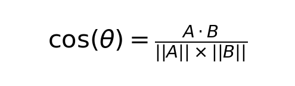

## How AI Deals With Correctly Being Incorrect
<b>Main Idea<b>: assign an LLM with the task of writing an extra chapter of Division By Zero in which Renee, under the made proof that 1=2, decides to rewrite a basic algorithm that would work properly under the consistency assumption of mathematics.

<ul>
  <li>Test if the algorithm is consistent with 1=2</li>
  <li>Test if the syntax and semantics of the prose maintains Chang’s style</li>
  <li>Does the LLM resort to standard mathematical jargon when it gets confused, or does it maintain Chang’s verbiage and tone</li>
  <li>Compare the syntax mathematically with a math paper to check this one</li>
</ul>
Test if the algorithm is consistent with 1=2
Test if the syntax and semantics of the prose maintains Chang’s style
Does the LLM resort to standard mathematical jargon when it gets confused, or does it maintain Chang’s verbiage and tone
Compare the syntax mathematically with a math paper to check this one

Automate the mathematical similarities between the generated chapter, one of Chiang’s actual chapters, and text from a random math paper. If the generated chapter leans more towards Chiang’s text, it was able to successfully complete this task. If it leans more towards the math paper, we can say it too often leans on math jargon than attempting to align with the syntax and grammar of Chiang’s text.

<b>Prompt: <b>“You are Ted Chiang writing the secret chapter of Division By Zero. The chapter should be after Claire had discovered that 1=2. She is trying to rewrite the proof for the quadratic formula. Make sure it fits thematically in the story, and maintain Chiang's grammar and syntax style.”
### Math Behind This

```python
   def get_pos_string(self, nlp, text):
       doc = nlp(text)
       return " ".join([token.pos_ for token in doc])
  
   def get_cosine_similarity(self):
       nlp = spacy.load("en_core_web_sm")
       pos_corpus = [self.get_pos_string(nlp, text) for text in [self.text1, self.text2, self.text3]]

       vectorizer = CountVectorizer(ngram_range = (1, 2))
       matrix = vectorizer.fit_transform(pos_corpus)

       similarity_1_2 = cosine_similarity(matrix[0], matrix[1])[0][0]
       similarity_1_3 = cosine_similarity(matrix[0], matrix[2])[0][0]
       similarity_2_3 = cosine_similarity(matrix[1], matrix[2])[0][0]

       return similarity_1_2, similarity_1_3, similarity_2_3
```

get_pos_string - converts each word into its part-of-speech tag. For example:
“I have a cat” -> PRON VERB DET NOUN

get_cosine_similarity - converts the string of parts-of-speech tags into a vector that counts how many times each pos 	appears, as well as how many times each pos pair appears. For example, the resulting vector for the above sentence would look like this:

| POS Tag   | Count |
|-----------|-------|
| PRON      | 1     |
| VERB      | 1     |
| ADJ       | 0     |
| DET       | 1     |
| NOUN      | 1     |
| PRON+VERB | 1     |
| VERB+ADJ  | 0     |
| PRON+ADJ  | 0     |


This would include all possible parts-of-speech as well as all possible combinations of parts-of-speech. 

Those vectors are then combined to form the full matrix. Each row of the matrix is then compared using the cosine similarity formula: 
{width=200px, height=100px}
This just calculates how much the vectors overlap and adjusts for the lengths.

Results:


Gemini Output
Math Gen Output
Raw Chiang Text
Gemini Output
1
0.754973
0.847864
Math Gen Output
0.754973
1
0.779017
Raw Chiang Text
0.847864
0.779017
1


