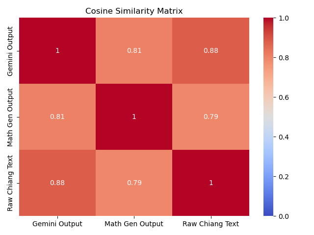

## How AI Deals With Correctly Being Incorrect

**Main Idea**: Assign an LLM the task of writing an extra chapter of *Division by Zero* in which Renee, under the made proof that 1=2, decides to rewrite a basic algorithm that would work properly under the consistency assumption of mathematics.

- Test if the algorithm is consistent with 1=2
- Test if the syntax and semantics of the prose maintains Chiang's style
- Does the LLM resort to standard mathematical jargon when it gets confused, or does it maintain Chiang's verbiage and tone
- Compare the syntax mathematically with a math paper to check this one

Automate the mathematical similarities between the generated chapter, one of Chiang's actual chapters, and text from a random math paper. If the generated chapter leans more towards Chiang's text, it was able to successfully complete this task. If it leans more towards the math paper, we can say it too often leans on math jargon than attempting to align with the syntax and grammar of Chiang's text.

**Prompt:** "You are Ted Chiang writing the secret chapter of Division By Zero. The chapter should be after Renee had discovered that 1=2. She is trying to rewrite the proof for the quadratic formula. Make sure it fits thematically in the story, and maintain Chiang's grammar and syntax style."

### Math Behind This

```python
def get_pos_string(self, nlp, text):
    doc = nlp(text)
    return " ".join([token.pos_ for token in doc])

def get_cosine_similarity(self):
    nlp = spacy.load("en_core_web_sm")
    pos_corpus = [self.get_pos_string(nlp, text) for text in [self.text1, self.text2, self.text3]]

    vectorizer = CountVectorizer(ngram_range=(1, 2))
    matrix = vectorizer.fit_transform(pos_corpus)
    full = cosine_similarity(matrix)

    return full[0, 1], full[0, 2], full[1, 2]
```

`get_pos_string` converts each word into its part-of-speech tag. For example:

`"I have a cat"` → `PRON VERB DET NOUN`

`get_cosine_similarity` converts the string of part-of-speech tags into a vector that counts how many times each POS appears, as well as how many times each POS pair appears. For example, the resulting vector for the above sentence would look like this:

| POS Tag   | Count |
|-----------|-------|
| PRON      | 1     |
| VERB      | 1     |
| ADJ       | 0     |
| DET       | 1     |
| NOUN      | 1     |
| PRON+VERB | 1     |
| VERB+ADJ  | 0     |
| PRON+ADJ  | 0     |

This includes all possible parts-of-speech as well as all possible combinations of parts-of-speech.

Those vectors are then compared using the cosine similarity formula:

<div align="center">
  
</div>

This calculates how much the vectors overlap and adjusts for the lengths.

### My Results

|                 | Gemini Output | Math Gen Output | Raw Chiang Text |
|-----------------|---------------|-----------------|-----------------|
| Gemini Output   | 1.000         | 0.850           | 0.884           |
| Math Gen Output | 0.850         | 1.000           | 0.788           |
| Raw Chiang Text | 0.884         | 0.788           | 1.000           |

<div align="center">
  
</div>
